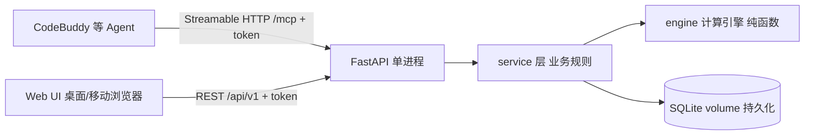

## 用户需求

构建一个纯个人使用的 AI 记账本，核心模型是打工人的现金流公式：**工资 = 日常开销 + 贷款 + 结余**，核心目标是预测月结余与年结余的量。收入侧以工资为基本项（recurring），另支持 bonus 类一次性收入（年终奖、意外收入等，走流水 income）；支出侧为日常开销 + 贷款月供。想买某个东西（尤其分期购买）时，能快速试算未来结余是否仍然为正。主要记账路径是自然语言——通过 agent 调用远程 MCP 完成记账、建贷款、查结余预测；Web UI 作为随时查看的窗口，桌面与移动端浏览器均可用。使用门槛极低、不考虑合规与多用户。**本地先跑通验证，Lighthouse 部署暂缓**（部署资产 Dockerfile/compose 照常备好）。

## 产品概述

单用户现金流管理工具，由三部分组成：(1) FastAPI + SQLite 后端，内置贷款/分期计算引擎与现金流预测/沙盘试算服务；(2) Streamable HTTP MCP 端点（/mcp），agent 配 URL + token 即可远程调用，工具接口面向自然语言设计——用户只需说"贷款总额、期数、利率"，摊还计算全自动；(3) 响应式 Web UI，移动端优先，随时用浏览器查看仪表盘与现金流曲线。整体单容器 Docker 部署到 Lighthouse。

## 核心功能

- 流水记账：收入/支出记录（金额、分类、日期、备注，Web 端 ≤3 个必填字段），区分来源 manual/mcp；bonus（年终奖、意外收入等一次性收入）走 income 流水，分类可标记"年终奖/意外收入"
- 周期项管理：工资（收入基本项）、房租等按月 recurring 收支，自动纳入结余预测
- 贷款/分期实体：一等公民模型，输入本金、年利率、期数、还款方式（等额本息/等额本金），后端自动生成完整摊还表（每期本金/利息/剩余）
- 结余预测：按月聚合未来 6-12 个月的收入-支出-月供，输出**月结余**与**年结余汇总**曲线，标注结余变负的风险月
- 沙盘试算：输入假设分期（如 2w 分 12 期）不落库，叠加现有负债试算未来结余曲线是否变负、最低结余是多少
- MCP 工具集：add_expense / add_income / add_loan / add_recurring / get_cashflow_forecast / simulate_purchase / list_recent，与 REST API 共用 service 层（MCP-first）
- 部署与持久化：SQLite 挂 volume、单 token 鉴权（env-only）、Dockerfile + docker-compose 备好备用（本阶段先本地运行）

## 技术选型

- 后端：Python 3.12 + FastAPI + SQLite（SQLAlchemy + Alembic 迁移，与 perf-admin 工程范式一致）
- MCP：官方 Python SDK（fastmcp）以 Streamable HTTP 挂载到 FastAPI 的 /mcp 路径，bearer token 鉴权
- 前端：Vue3 + Vite + TypeScript + **Naive UI**（成熟稳定、原生暗色主题完善、Tree Shaking 友好）+ Tailwind CSS 布局，ECharts（vue-echarts）画结余曲线
- 测试：pytest（计算引擎单测为核心）
- 部署：多阶段 Dockerfile（node build 前端 → python slim runtime），docker-compose + volume 持久化 SQLite，token 走 .env（env-only）；本阶段仅本地 uvicorn + vite dev 跑通，部署资产备好备用

## 实现思路

### 总体策略

业务规则全部收敛在 service 层，REST 路由与 MCP 工具都是薄适配层（MCP-first 原则）。计算引擎为纯函数模块，无 I/O，便于单测。前端构建产物由 FastAPI StaticFiles 托管，单容器交付，Lighthouse 上 docker compose up 即完成部署。

### 数据模型（SQLite，金额一律用整数"分"存储避免浮点误差）

- transactions(id, amount_cents, direction[income|expense], category, occurred_date, note, source[manual|mcp], created_at)
- recurring_items(id, name, amount_cents, direction, category, day_of_month, start_month, end_month|null, active)
- loans(id, name, principal_cents, annual_rate_bp（基点）, periods, method[equal_payment|equal_principal], start_date, status)
- loan_schedules(loan_id, period_no, due_month, principal_cents, interest_cents, remaining_cents) — 建贷款时一次性预生成，查询/聚合零计算开销

### 计算引擎（engine/ 纯 Python，pytest 全覆盖）

- 等额本息月供：M = P·r·(1+r)^n / ((1+r)^n − 1)，r 为月利率；等额本金逐期递减
- 摊还表生成时按"分"为单位做舍入，最后一期吸收尾差，保证 Σ各期本金 = 本金总额（单测强制校验）
- 现金流预测：对未来 N 个月，每月净额 = Σ活跃 recurring（按月展开）+ Σ贷款当期月供 + 当月已录流水；同时输出累计结余曲线（基于用户设定的期初现金余额，存 settings 表）与**按自然年聚合的年结余汇总**
- 沙盘试算 simulate_purchase(amount, periods, rate)：构造虚拟贷款对象复用同一摊还函数，叠加到预测曲线上，返回逐月净额、最低结余、首个变负月份——纯计算不落库，O(N) 复杂度

### MCP 工具设计（面向自然语言，参数尽量可省略）

- add_expense(amount, category?, note?, date?=今天) / add_income 同理，分类缺省自动归入"其他"
- add_loan(name, principal, periods, annual_rate, method?=equal_payment, start_date?=当月)：内部完成摊还并回读月供摘要
- get_cashflow_forecast(months?=12)：返回逐月收入/支出/月供/净额/累计结余
- simulate_purchase(amount, periods, annual_rate?=0, months?=12)：沙盘结果含中文结论（"第 X 月现金流转负，最低结余 -Y 元"）
- 工具 docstring 用中文写清使用场景，agent 才能正确路由用户口语化请求

### 性能与可靠性

- 单机单用户量级极小（流水年千级、贷款个位数），无任何性能瓶颈；唯一注意点：预测接口按月聚合时一次性查出区间内的 recurring/loans/schedules 在内存中展开，避免逐月查库（N+1）
- 摊还表预生成落库换取查询零计算；贷款删除/修改走重建摊还表事务
- 鉴权：单一 API_TOKEN（环境变量注入），FastAPI dependency 校验 Authorization: Bearer，同时保护 REST 与 /mcp；个人用不做用户体系，但杜绝裸奔
- 安全：SQLAlchemy 参数绑定杜绝注入；CORS 收敛到同源（前端同源托管，无需放开）；.env 不入库不打包，.dockerignore 排除

### 架构与目录



```
ai-ledger/
├── server/
│   ├── main.py                  # FastAPI 入口：挂 REST 路由 + /mcp + StaticFiles 托管前端产物 + token 鉴权 dependency
│   ├── config.py                # 环境变量读取（API_TOKEN、DB_PATH、INITIAL_BALANCE），fail-fast 校验
│   ├── db.py / models.py        # SQLAlchemy 引擎与 4 张表 + settings 表
│   ├── alembic/                 # 迁移脚本
│   ├── engine/                  # [核心] 纯函数计算：amortize.py（摊还表）、forecast.py（现金流预测）、simulate.py（沙盘）
│   ├── services/                # 业务规则唯一落点：transaction/loan/recurring/cashflow service
│   ├── api/routes.py            # REST /api/v1 薄适配层
│   └── mcp_server.py            # fastmcp 工具定义，全部委托 service 层
├── web/                         # Vue3 + Vite + Naive UI 前端
│   └── src/{views,components,api}/  # Dashboard / Transactions / Loans / Forecast 四页 + 沙盘交互组件
├── tests/                       # pytest：月供公式、尾差校验、预测聚合、沙盘边界
├── scripts/mcp_stdio_proxy.py   # [可选] 本地 stdio→远程 HTTP 包装，方便只支持 stdio 的客户端
├── Dockerfile                   # 多阶段：node:20-alpine build web → python:3.12-slim runtime，非 root 运行
├── docker-compose.yml           # 单服务 + named volume 挂 SQLite + env_file
├── .dockerignore / .env.example
└── README.md                    # Lighthouse 部署命令、agent 端 MCP 配置示例
```

### 实施注意

- 金额全程整数分，仅展示层除以 100 格式化；利率用基点（万分之一）存储
- 月供预测按"当月发生即计入当月"，不按精确日切分，保持口径简单可解释
- 日志仅用 uvicorn 默认 access log + service 层关键写操作 info 级记录，不打敏感金额之外的冗余信息
- 兼容面：token 校验失败统一 401，不区分 REST/MCP；数据库文件默认 /data/ledger.db，volume 挂载即持久化

## 设计风格

**绿黑极客风（terminal hacker aesthetic）**：纯黑近零亮度底色 + 荧光绿主色调，数字用等宽字体（JetBrains Mono）大字号排版，营造"终端里看现金流"的极客感。收入/结余为绿色系，支出/风险为红色警示，辅以扫描线/发光边框等克制的终端质感装饰。桌面端三栏/宽卡片布局，移动端折叠为单列 + 底部 Tab 导航。用 Vue3 + Naive UI（dark theme 定制绿色 accent）+ Tailwind 实现，ECharts 绘制结余曲线（绿线/红柱，网格线极淡）。

## 页面规划（4 页）

1. **仪表盘（首页）**：顶部本月概览卡（收入/支出/月供/**月结余**四个大数字，等宽字体荧光绿）；"预计年结余"为视觉焦点的大号金额；未来 6 月迷你结余趋势条；底部 Tab 导航（移动端）。
2. **流水页**：顶部悬浮"记一笔"按钮，弹出底部抽屉表单（金额/分类/备注三字段，收入侧分类含"工资/年终奖/意外收入"）；列表按月分组，收入绿支出红，左滑删除。
3. **贷款页**：贷款卡片列表（名称、剩余本金、月供、进度环）；点开展开摊还表（每期本金/利息，可滚动表格）；新增贷款表单只需名称/本金/年利率/期数/还款方式。
4. **结余预测页**：ECharts 折线+柱状组合图展示未来 12 月净结余与累计结余，变负月份红色高亮；顶部沙盘试算输入条（金额+期数+利率），实时叠加虚线曲线对比，底部给出中文结论。

## 交互细节

- 所有金额输入为全宽大键盘数字输入；分类用横向滑动 chip 选择
- 沙盘曲线切换带 300ms 过渡动画；卡片 hover/按压微缩放反馈
- 桌面端最大宽度 1200px 居中；移动端安全区适配（viewport-fit=cover），附 PWA manifest 可"添加到主屏幕"

## Agent Extensions

### Skill

- **frontend-design**
- Purpose：构建 Web UI 前先加载该 skill，获取高质量、反 generic AI 风格的前端设计指导，用于仪表盘/流水/贷款/预测四页的视觉实现
- Expected outcome：产出具有绿黑极客风（终端质感、荧光绿大数字、等宽字体）质感、移动端体验优秀的界面代码，符合 design 节定义的字体与色彩体系

### Integration

- **lighthouse**（本阶段暂缓）
- Purpose：后续部署阶段查询/操作 Lighthouse 实例，将 docker-compose 服务发布到用户的 Lighthouse 服务器并验证可访问
- Expected outcome：本期仅备好 Dockerfile/docker-compose 部署资产并在本地跑通；用户确认效果后再启用该 integration 完成公网部署